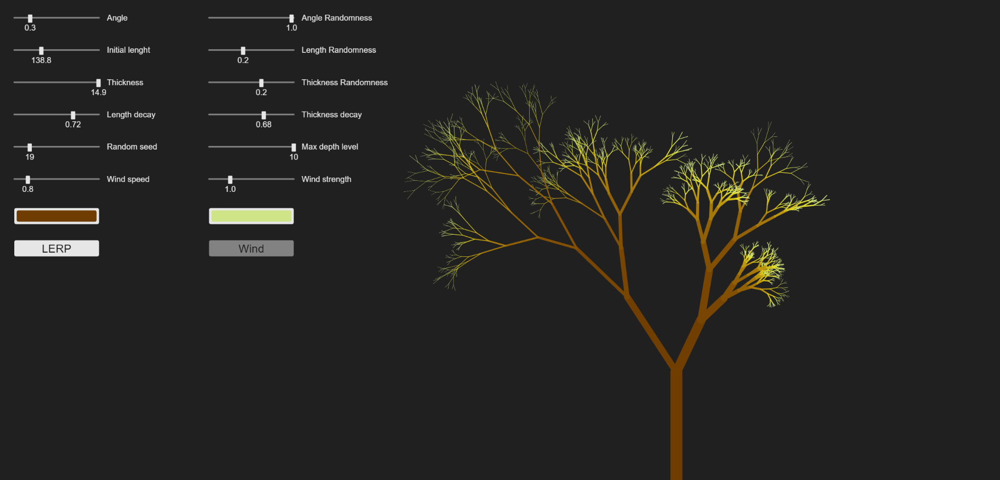

# js-ui_on_canvas_example
This is a small proyect on recursively drawing trees using <a href="https://p5js.org/">p5.js</a>.
## Parameters
  - Angle: mean angle wich the branches are rotated
  - Angle randomness: randomness to apply to the angle
  - Initial length: length of the main branch
  - Length randomness: randomness to apply to the length
  - Thickness: thickness of the main branch
  - Thickness randomness: randomness to apply to the thickness
  - Length decay: mean decay applied to the length in each depth
  - Thickness decay: mean decay applied to the thickness in each depth
  - Random seed
  - Max depth level: maximum number of branches
  - Wind speed: speed of the wind
  - Wind strenth: strength of the wind
  - Color1: first color of the tree
  - Color2: second color of the tree
  - Lerp: whether interpolate between the 2 colors, the interpolation is not actually linear but cuadratic
  - Wind: whether to apply wind
## Screenshot
</img>
## References
To find more information about the <b>awesome</b> library used for this proyect visit:
<a href="https://p5js.org/"> https://p5js.org/ </a>
